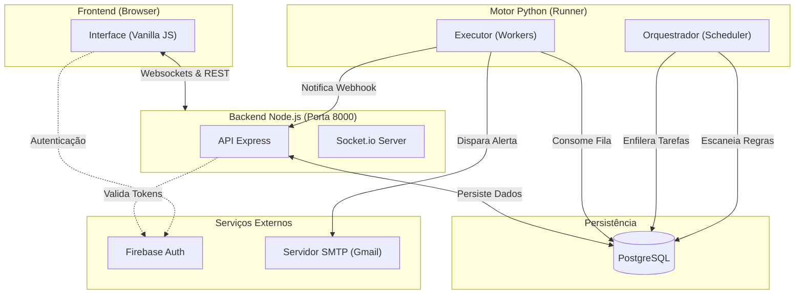
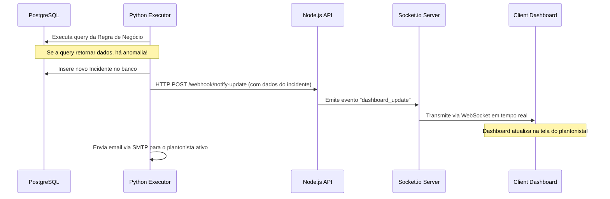

# 📊 Arquitetura do Sistema - Plantão Monitor

O **Plantão Monitor** é uma plataforma distribuída projetada para monitoramento operacional em tempo real, detecção de incidentes por consultas de banco de dados e notificação automática de equipes de suporte (plantonistas).

---

## 🏗️ Visão Geral da Arquitetura

O sistema é dividido em três camadas principais operando em paralelo:

---

## 🛡️ Descrição dos Componentes

### 1. Servidor de Aplicação & WebSockets (Node.js)
* **Arquivo de Entrada:** `api_qq_monitor.js`
* **Porta Padrão:** `8000`
* **Principais Tecnologias:** Express, Socket.io, Firebase Admin SDK, pg (node-postgres), Pino logger.
* **Responsabilidades:**
  * Prover endpoints REST para gestão de incidentes, escalas de plantão, regras e usuários.
  * Autenticar requisições usando o Firebase Admin SDK (validação de tokens JWT do cliente).
  * Manter conexões WebSocket ativas com os navegadores abertos no Dashboard.
  * Expor um webhook interno (`POST /webhook/notify-update`) utilizado pelo motor Python para enviar atualizações de incidentes, que são retransmitidas em tempo real via Socket.io.

### 2. Motor de Agendamento e Execução (Python 3)
O backend Python roda de forma independente da API Node.js, focando exclusivamente na lógica de verificação periódica de regras de negócio.
* **Orquestrador (`src/runner/orquestrador.py`):**
  * Responsável pelo agendamento usando a biblioteca `APScheduler` ou `schedule`.
  * Consulta periodicamente as regras cadastradas no banco de dados e adiciona requisições de execução à fila de processamento no banco.
* **Executor (`src/runner/executor.py`):**
  * Consome as tarefas pendentes na fila de execução do banco de dados.
  * Executa a query SQL associada à regra de negócio no banco PostgreSQL.
  * Se a query retornar linhas (anomalia detectada), gera um incidente no banco de dados.
  * Dispara um webhook HTTP para a API Node.js avisando da alteração para atualização do painel do usuário.
  * Dispara notificações por e-mail via SMTP aos usuários escalados no plantão.

### 3. Banco de Dados (PostgreSQL)
* **Schema:** `qq_monitor`
* **Responsabilidades:**
  * Armazenamento das regras de negócio (as queries SQL dinâmicas).
  * Fila de execução de regras compartilhada entre o Orquestrador e o Executor (mecanismo de fila baseado em banco de dados).
  * Log de auditoria, log de execuções de regras e histórico de incidentes.

---

## 🔄 Fluxo de Notificação de Incidente

